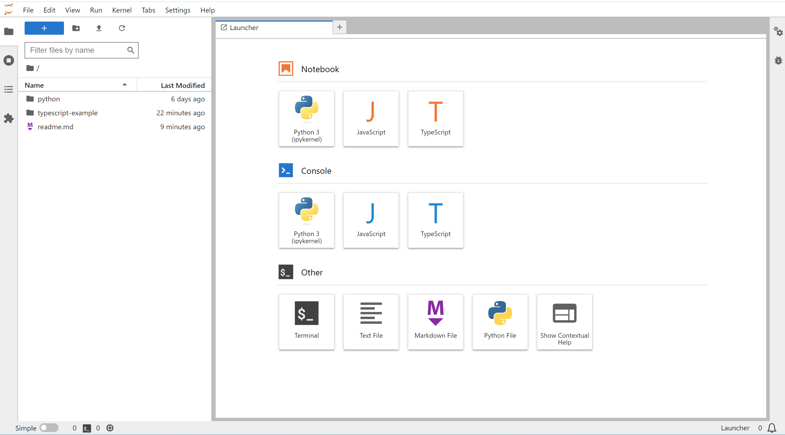

# Jupyter Lab Quality Engineering Investigations

The purpose of this project is to explore and document potential uses of Jupyter notebooks in the context of quality engineering activities. What can it be used for and what uses make sense given the array of other tools available for use.

## Jupyter Lab Setup

You will need to install Python and Jupyter Lab to run the examples.

* Install Python3
    * https://phoenixnap.com/kb/how-to-install-python-3-windows
    * https://www.python.org/downloads/windows/
    * 
* Install jupyter lab
    * https://jupyter.org/install
    * For a more detailed getting started https://jupyterlab.readthedocs.io/en/stable/getting_started/installation.html

## Opening These Example Notebooks

By default, Jupyter Lab will run as if the current user's home folder is your notebook directory. I recommend creating separate folders for storing notebooks to keep sets of notebooks more manageable. The following command runs jupyter lab with a specified notebook folder.

    jupyter lab --notebook-dir=C:/my-notebooks

You can find additional documentation at https://jupyterlab.readthedocs.io/en/stable/

If you cloned this repo to C:/Projects/jupyter/notebooks, then the following command will run jupyter lab pointed to this collection of example notebooks.

    jupyter lab --notebook-dir=C:/Projects/jupyter/notebooks

The browser should automatically open to the following. Your environment will not contain the javascript or typescript items unless you have worked through the [readme.md](typescript-example/readme.md) inside of the typescript-example folder.

### Quickest Start

Open the python folder and then double click the hello-world.ipynb to open a python based notebook with a few basic examples. 

### Typescript, Playwright and Mocha Examples

The example in typescript-example are more in depth explorations of using a nodejs kernel in a notebook.  The [readme.md](typescript-example/readme.md) will explain the prerequisites.

